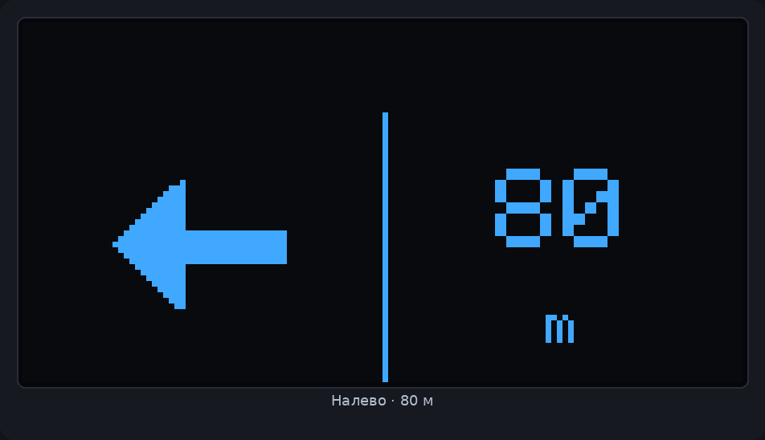
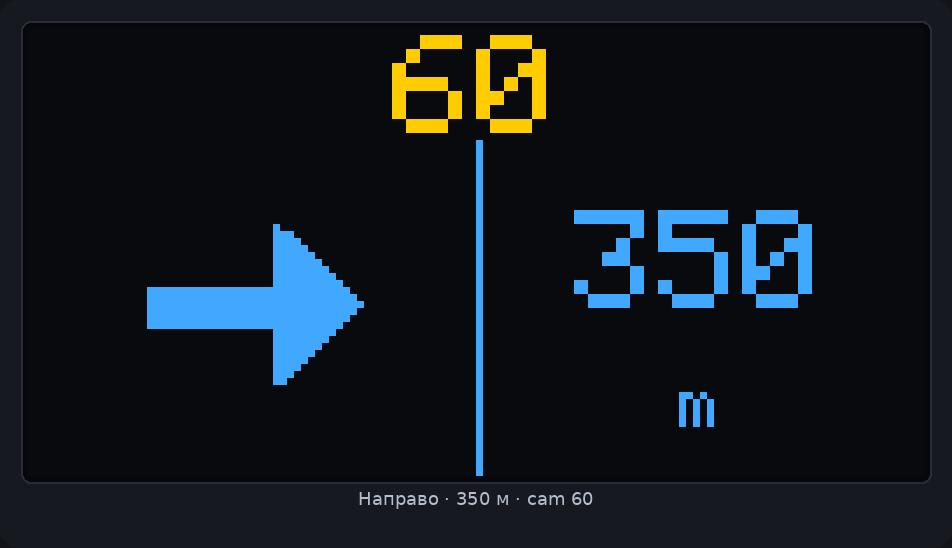
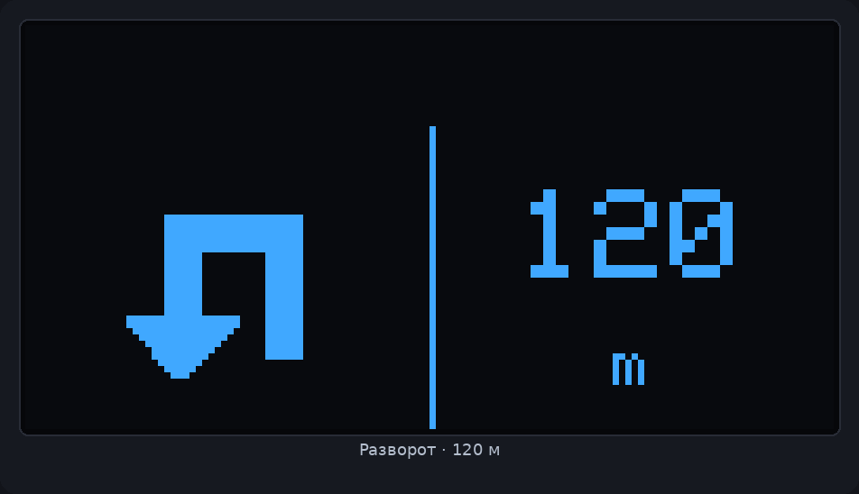
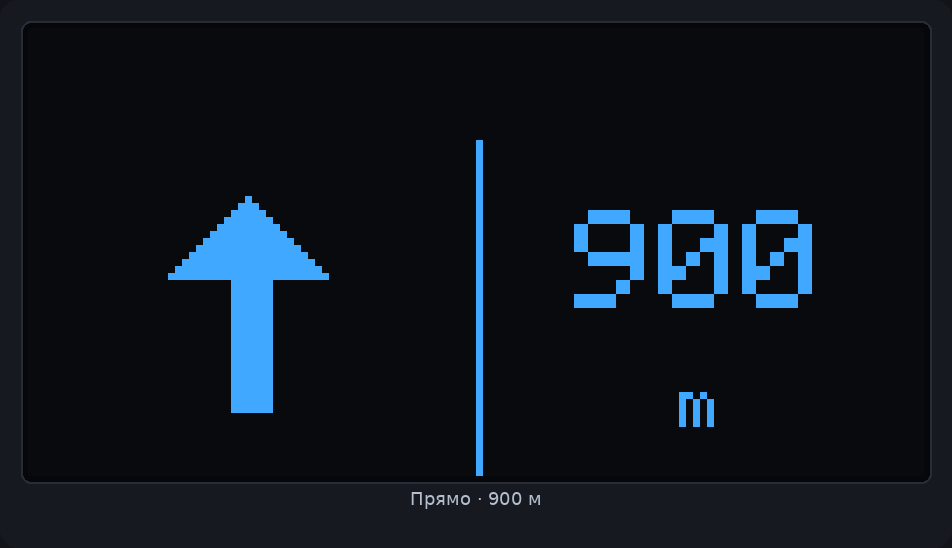
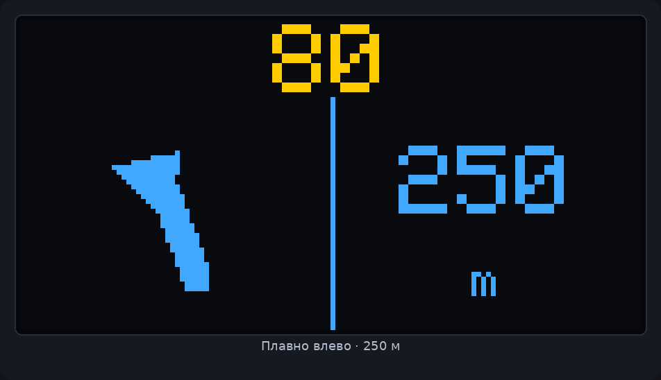
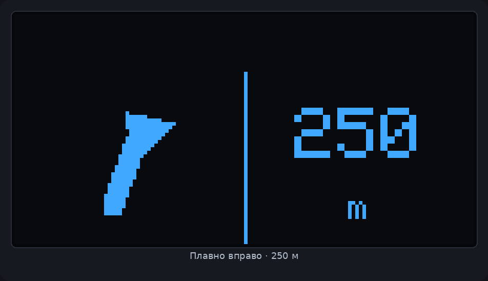

# Atenboro Nav

**2ГИС → OLED HUD** для платы **HW-364A** (ESP8266 + SSD1306 128×64 dual-color).

[](VERSION)
[](firmware/)
[](android/)
[](LICENSE)

Телефон читает манёвры 2ГИС и рисует их на бортовом OLED: стрелка, метры до поворота, мигающий лимит камеры.

<p align="center">
  
</p>

```
2ГИС ── a11y / notifications / logcat ──► Atenboro Android ── Wi‑Fi SoftAP ──► ESP8266 OLED
```

## HUD

Dual-color панель разделена по строкам:

<p align="center">
  
</p>

| Зона | Цвет | Что показывает |
|------|------|----------------|
| `y0–15` | жёлтый | камера: мигание + лимит км/ч (пусто, если камеры нет) |
| `y16–63` левая половина | синий | встроенная стрелка манёвра |
| `y16–63` правая половина | синий | дистанция + `m` |

<p align="center">
  
</p>

| | | |
|:---:|:---:|:---:|
|  |  |  |
|  |  |  |

## Состав

| Путь | Что внутри |
|------|------------|
| [`firmware/`](firmware/) | PlatformIO: SoftAP + HTTP + OLED HUD |
| [`android/`](android/) | Kotlin-прокси 2ГИС → плата |
| [`docs/WIRING.md`](docs/WIRING.md) | Пины HW-364A, SoftAP, API |
| [`docs/TESTING.md`](docs/TESTING.md) | Чеклист проверки |
| [`docs/screens/`](docs/screens/) | Снимки OLED с платы |
| [`scripts/`](scripts/) | curl / OLED stage-тесты |
| [`VERSION`](VERSION) | Semver (`0.1.5`) |

## Быстрый старт

### 1. Прошивка

```bash
cd firmware
../.venv/bin/pio run -t upload --upload-port /dev/ttyUSB0
```

SoftAP: **`atenboro-nav`** / **`atenboro1`** → [`http://192.168.4.1`](http://192.168.4.1)

На splash: логотип, C-130 и версия прошивки. Готовый `.bin` — в [Releases](https://github.com/jdmarshall95/atenboro-nav/releases).

```bash
./scripts/test_oled.sh
```

### 2. Android

1. Соберите APK из `android/` (или скачайте из релиза).
2. Подключитесь к SoftAP платы → в приложении **«Подключить к плате»** (`bindProcessToNetwork`).
3. Включите **Accessibility** и **доступ к уведомлениям**.
4. Запустите прокси → навигация в 2ГИС (экран можно блокировать).
5. Отладка: **Тест OLED**, **Debug: лог ↔ плата**, снимок `/screen`.

## HTTP API

| Метод | Путь | Назначение |
|-------|------|------------|
| `GET` | `/health` | `{"ok":true,"version":"0.1.5"}` |
| `POST` | `/nav` | HUD: `turn`, `dist_m`, `camera`, `cam_m`, `cam_kmh`, `street` |
| `GET` | `/screen` | framebuffer SSD1306 + `X-OLED-META` |
| `GET/POST/DELETE` | `/debug` | кольцевой лог платы ↔ телефон |

```bash
curl -s -X POST http://192.168.4.1/nav \
  -H 'Content-Type: application/json' \
  -d '{"turn":"left","dist_m":80,"camera":false,"cam_kmh":-1}'
```

Инжект с телефона (stage-тесты без живого 2ГИС):

```bash
adb shell am start -n com.atenboro.nav/.MainActivity \
  --es turn right --ei dist_m 350 --ez camera true \
  --ei cam_m 180 --ei cam_kmh 60 --es street Sayanskaya
```

## Версионирование

| Место | Файл |
|-------|------|
| Корень | [`VERSION`](VERSION) |
| Прошивка | [`firmware/src/version.h`](firmware/src/version.h) |
| Android | `versionName` / `versionCode` в `android/app/build.gradle.kts` |
| История | [`CHANGELOG.md`](CHANGELOG.md) |

Релиз = синхронный bump + git-тег `vX.Y.Z` + GitHub Release с `.bin` / APK.

## Железо

Плата **HW-364A**: OLED I2C обычно **SDA=GPIO4 / SCL=GPIO5** (или swap) — прошивка сканирует пары сама. Подробности: [docs/WIRING.md](docs/WIRING.md).

## Ограничения

- 2ГИС на Qt отдаёт мало accessibility-текста; в фоне опираемся на notification `largeIcon` / RemoteViews и logcat-клипы.
- SoftAP без интернета: без «Подключить к плате» Android уведёт HTTP в LTE.
- Живая навигация 2ГИС перебивает adb-инжекты — для stage-тестов остановите 2ГИС.

## Лицензия

[MIT](LICENSE)
