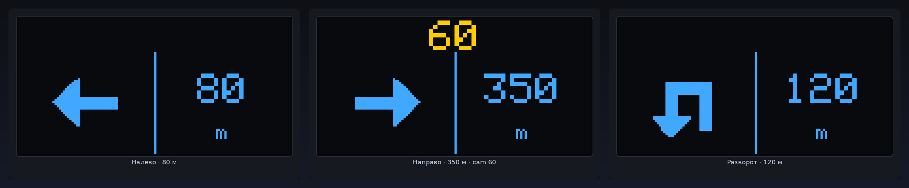
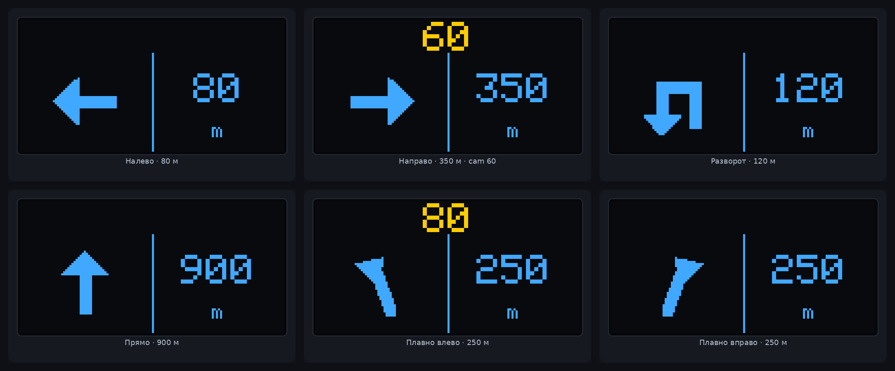
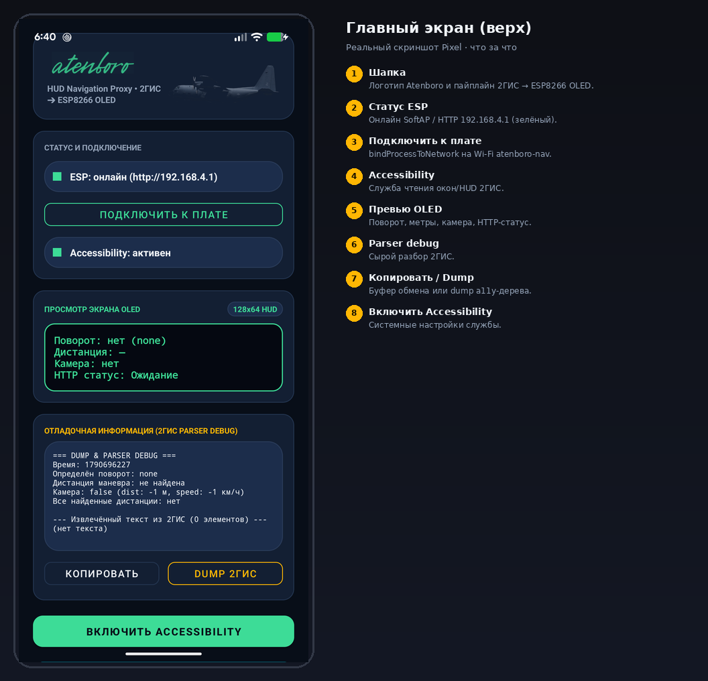
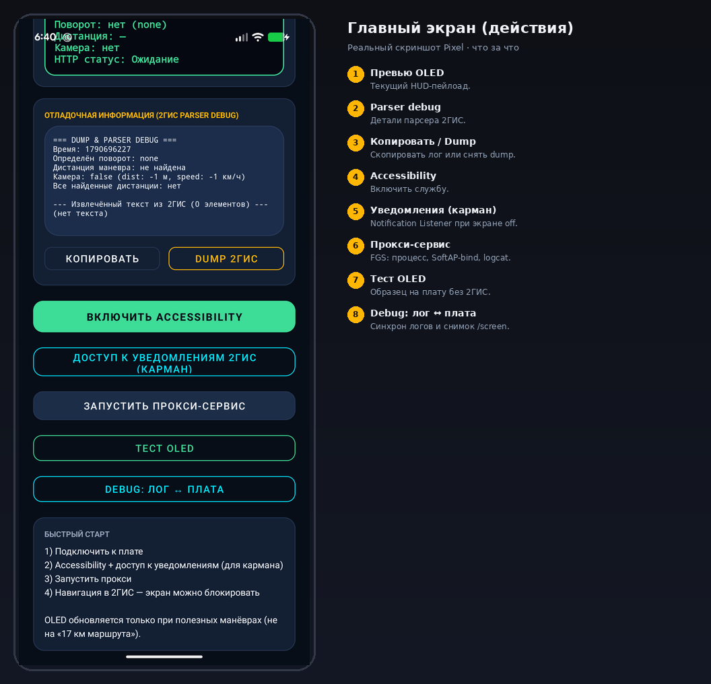
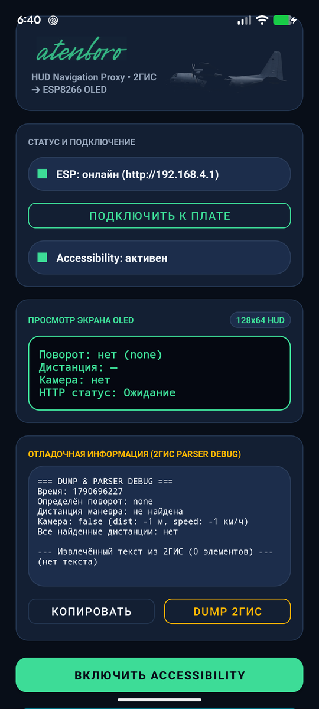
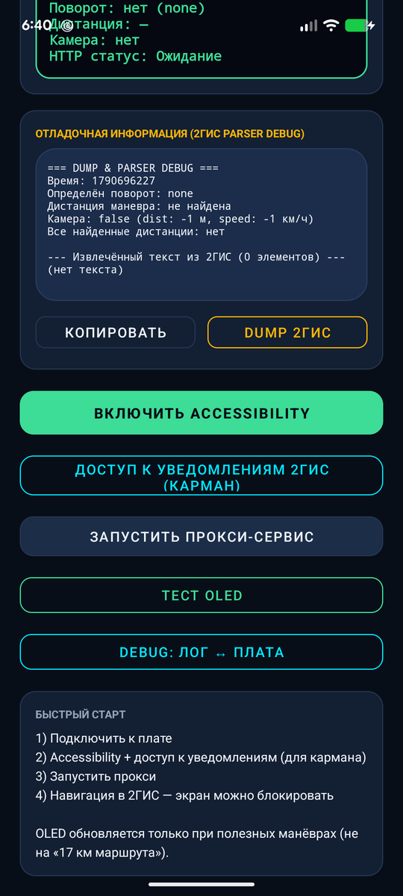
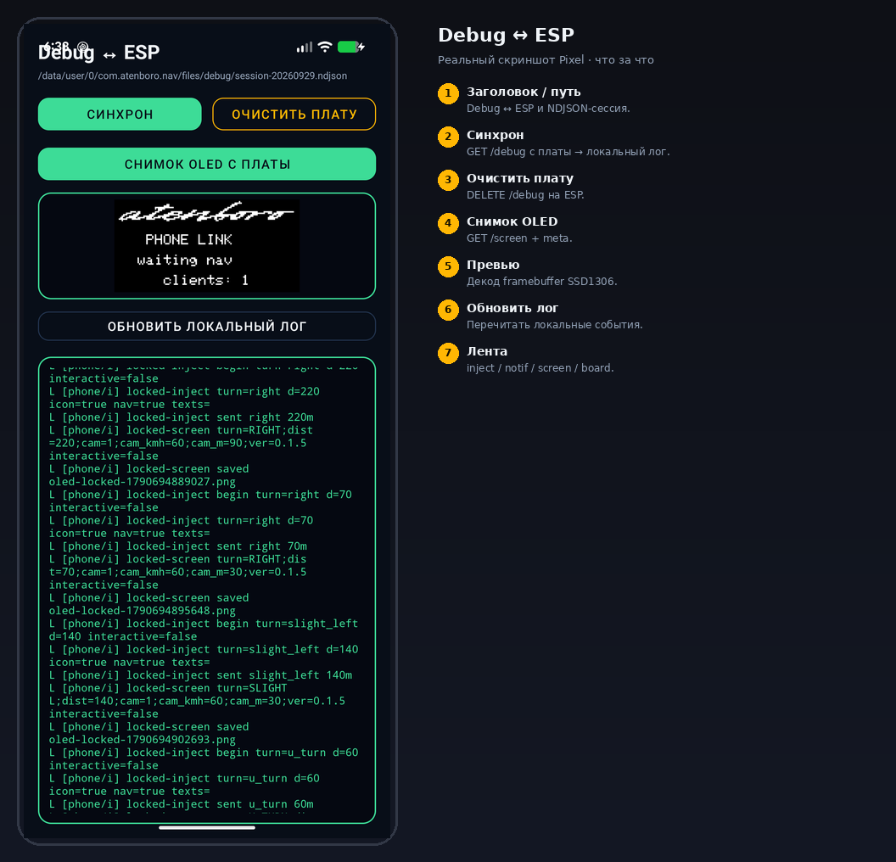

# Atenboro Nav

**2ГИС → OLED** на плате HW-364A (ESP8266 + SSD1306 128×64).

[](VERSION)
[](LICENSE)

Телефон читает манёвры 2ГИС и рисует их на OLED: стрелка, метры, мигающий лимит камеры.

<p align="center">
  
</p>

```
2ГИС ──► Atenboro (Android) ── SoftAP ──► ESP8266 OLED
```

## OLED HUD

| Полоса | Цвет | Содержание |
|--------|------|------------|
| сверху (`y0–15`) | жёлтый | камера: мигание + км/ч |
| снизу слева | синий | шеврон манёвра |
| снизу справа | синий | дистанция + `m` |

<p align="center">
  
</p>

## Приложение Android

Реальные скриншоты с Pixel.

### Главный экран

<p align="center">
  
</p>

| # | Элемент | Зачем |
|---|---------|--------|
| 1 | Шапка | Бренд и схема 2ГИС → OLED |
| 2 | Статус ESP | SoftAP / HTTP до платы |
| 3 | **Подключить к плате** | `bindProcessToNetwork` на `atenboro-nav` |
| 4 | Accessibility | Чтение окон/HUD 2ГИС |
| 5 | Превью OLED | Поворот, метры, камера, HTTP |
| 6 | Parser debug | Сырой разбор 2ГИС |
| 7 | Копировать / Dump | Буфер обмена или dump a11y |
| 8 | **Включить Accessibility** | Системные настройки службы |

<p align="center">
  
</p>

| # | Элемент | Зачем |
|---|---------|--------|
| 4 | **Включить Accessibility** | Системные настройки a11y |
| 5 | **Уведомления 2ГИС** | Карманный режим (экран off) |
| 6 | **Прокси-сервис** | FGS: процесс, SoftAP-bind, logcat |
| 7 | Тест OLED | Образец на плату без 2ГИС |
| 8 | **Debug: лог ↔ плата** | Синхрон логов и `/screen` |

Типичный порядок: **Подключить к плате → Accessibility → уведомления → прокси → навигация в 2ГИС**.

<p align="center">
  
  
  
</p>

### Debug ↔ ESP

<p align="center">
  
</p>

| # | Элемент | Зачем |
|---|---------|--------|
| 1 | Заголовок / путь | NDJSON-сессия на телефоне |
| 2 | Синхрон | `GET /debug` с платы |
| 3 | Очистить плату | `DELETE /debug` |
| 4 | Снимок OLED | `GET /screen` + meta |
| 5 | Превью | Декод SSD1306 |
| 6 | Обновить лог | Локальные события |
| 7 | Лента | inject / notif / screen / board |

## Быстрый старт

**Прошивка**

```bash
cd firmware && ../.venv/bin/pio run -t upload --upload-port /dev/ttyUSB0
```

SoftAP: `atenboro-nav` / `atenboro1` → `http://192.168.4.1`  
Готовый `.bin` и APK — в [Releases](https://github.com/jdmarshall95/atenboro-nav/releases).

**Android**

1. Установить APK, Wi‑Fi → SoftAP платы.
2. «Подключить к плате» → Accessibility → уведомления → прокси.
3. Навигация в 2ГИС (экран можно блокировать).

Чеклист и locked-screen тест: [`docs/TESTING.md`](docs/TESTING.md).

## API платы

| | | |
|--|--|--|
| `GET` | `/health` | версия |
| `POST` | `/nav` | `turn`, `dist_m`, `camera`, `cam_m`, `cam_kmh` |
| `GET` | `/screen` | framebuffer + meta |
| `*` | `/debug` | лог телефон ↔ плата |

```bash
curl -s -X POST http://192.168.4.1/nav \
  -H 'Content-Type: application/json' \
  -d '{"turn":"left","dist_m":80,"camera":true,"cam_kmh":60}'
```

## Репозиторий

| | |
|--|--|
| [`firmware/`](firmware/) | SoftAP + OLED |
| [`android/`](android/) | прокси 2ГИС |
| [`docs/screens/`](docs/screens/) | OLED + UI |
| [`docs/WIRING.md`](docs/WIRING.md) | пины |
| [`docs/TESTING.md`](docs/TESTING.md) | чеклист |
| [`CHANGELOG.md`](CHANGELOG.md) | история |

## Заметки

- 2ГИС на Qt почти не отдаёт a11y-текст — в фоне работают notification icon и logcat.
- SoftAP без интернета: без «Подключить к плате» HTTP уйдёт в LTE.

## Лицензия

[MIT](LICENSE)
