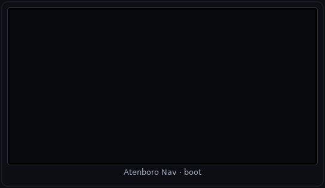
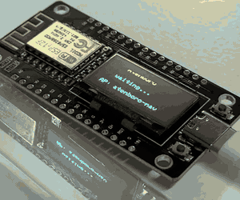
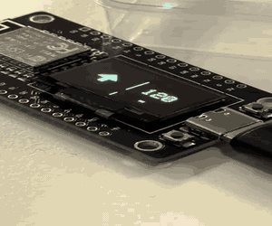

# Atenboro Nav — DIY мотонавигатор / bike OLED HUD

Телефон в кармане с привычным **2ГИС** (Яндекс — в планах), на руле — дешёвый **OLED**: куда свернуть и через сколько метров. Без держалки смартфона и без отдельного приложения с картами.

**2ГИС → OLED** на плате HW-364A (**ESP8266** + **SSD1306** 128×64 dual-color). Сейчас Wi‑Fi SoftAP; дальше — **ESP32** + BLE. Open source, MIT.

[](VERSION)
[](LICENSE)

Android-прокси читает манёвры 2ГИС (notification / Accessibility) и рисует turn-by-turn на OLED: шеврон, дистанция, мигающий лимит камеры.

<p align="center">
  
</p>

```
2ГИС ──► Atenboro (Android) ── SoftAP ──► ESP8266 OLED
```

## OLED HUD

| Полоса | Цвет | Содержание |
|--------|------|------------|
| сверху (`y0–15`) | жёлтый | камера: мигание + лимит км/ч |
| снизу слева | синий | шеврон манёвра (в т.ч. slight / u-turn) |
| снизу справа | синий | дистанция: метры, с 1 км — `3.8` + `km`, с 10 км — целые км |

<p align="center">
  
</p>

<p align="center">
  
</p>

## Плата вживую


**SoftAP / splash**

<p align="center">
  
</p>

**HUD**

<p align="center">
  
</p>


## Приложение Android

Реальные скриншоты с устройства.

### Главный экран

<p align="center">
  
</p>

| # | Элемент | Зачем |
|---|---------|--------|
| 1 | Шапка | Бренд и схема 2ГИС → OLED |
| 2 | Статус ESP | SoftAP / HTTP до платы |
| 3 | **Подключить к плате** | `bindProcessToNetwork` на `atenboro-nav` |
| 4 | Accessibility | Чтение окон/HUD 2ГИС |
| 5 | Превью OLED | Поворот, метры, камера, HTTP |
| 6 | Parser debug | Сырой разбор 2ГИС |
| 7 | Копировать / Dump | Буфер обмена или dump a11y |
| 8 | **Включить Accessibility** | Системные настройки службы |

<p align="center">
  
</p>

| # | Элемент | Зачем |
|---|---------|--------|
| 4 | **Включить Accessibility** | Системные настройки a11y |
| 5 | **Уведомления 2ГИС** | Карманный режим (экран off) |
| 6 | **Прокси-сервис** | FGS: процесс, SoftAP-bind, logcat |
| 7 | Тест OLED | Образец на плату без 2ГИС |
| 8 | **Debug: лог ↔ плата** | Синхрон логов и `/screen` |

Типичный порядок: **Подключить к плате → Accessibility → уведомления → прокси → навигация в 2ГИС**.

<p align="center">
  
  
  
</p>

### Debug ↔ ESP

<p align="center">
  
</p>

| # | Элемент | Зачем |
|---|---------|--------|
| 1 | Заголовок / путь | NDJSON-сессия на телефоне |
| 2 | Синхрон | `GET /debug` с платы |
| 3 | Очистить плату | `DELETE /debug` |
| 4 | Снимок OLED | `GET /screen` + meta |
| 5 | Превью | Декод SSD1306 |
| 6 | Обновить лог | Локальные события |
| 7 | Лента | inject / notif / screen / board |

## Быстрый старт

**Прошивка**

```bash
cd firmware && ../.venv/bin/pio run -t upload --upload-port /dev/ttyUSB0
```

SoftAP: `atenboro-nav` / `atenboro1` → `http://192.168.4.1`  
Готовый `.bin` и APK — в [Releases](https://github.com/jdmarshall95/atenboro-nav/releases).

**Android**

1. Установить APK, Wi‑Fi → SoftAP платы.
2. «Подключить к плате» → Accessibility → уведомления → прокси.
3. Навигация в 2ГИС (экран можно блокировать).

Чеклист и locked-screen тест: [`docs/TESTING.md`](docs/TESTING.md).  
Симуляция заезда (inject HUD / mock GPS): [`scripts/sim_route_drive.sh`](scripts/sim_route_drive.sh) — режимы `hud`, `geo`, `full`.  
Мото по маршруту 2ГИС (полилиния + GPS): [`scripts/gis_moto_drive.py`](scripts/gis_moto_drive.py).

**Эмулятор без платы** (mock SoftAP на хосте, LTE/интернет у AVD не трогаем):

```bash
./scripts/mock_board.py              # http://0.0.0.0:18765
./scripts/emu_mock_drive.sh          # setprop + inject slight/u-turn/3.8km/12km
```

`adb shell setprop debug.atenboro.esp_url http://10.0.2.2:18765` — приложение шлёт `/nav` на mock вместо `192.168.4.1`.

## API платы

| Метод | Путь | Описание |
|-------|------|----------|
| `GET` | `/health` | версия |
| `POST` | `/nav` | `turn`, `dist_m`, `camera`, `cam_m`, `cam_kmh` |
| `GET` | `/screen` | framebuffer + meta |
| `*` | `/debug` | лог телефон ↔ плата |

```bash
curl -s -X POST http://192.168.4.1/nav \
  -H 'Content-Type: application/json' \
  -d '{"turn":"left","dist_m":80,"camera":true,"cam_kmh":60}'
```

## Репозиторий

| | |
|--|--|
| [`firmware/`](firmware/) | SoftAP + OLED |
| [`android/`](android/) | прокси 2ГИС |
| [`docs/screens/`](docs/screens/) | OLED + UI |
| [`docs/screens/field/`](docs/screens/field/) | живые GIF/MP4 платы |
| [`docs/WIRING.md`](docs/WIRING.md) | пины |
| [`docs/TESTING.md`](docs/TESTING.md) | чеклист |
| [`scripts/sim_route_drive.sh`](scripts/sim_route_drive.sh) | симуляция заезда (hud/geo/full) |
| [`scripts/gis_moto_drive.py`](scripts/gis_moto_drive.py) | маршрут 2ГИС → полилиния → GPS мотоциклом |
| [`scripts/mock_board.py`](scripts/mock_board.py) | mock SoftAP HTTP для эмулятора |
| [`scripts/emu_mock_drive.sh`](scripts/emu_mock_drive.sh) | inject против mock_board |
| [`scripts/render_boot_gif.py`](scripts/render_boot_gif.py) | GIF splash для README |
| [`scripts/pack_field_gifs.py`](scripts/pack_field_gifs.py) | MOV → field GIF/MP4 |
| [`CHANGELOG.md`](CHANGELOG.md) | история |
| Roadmap | [железо и BLE](#roadmap--железо) |

## Заметки

- 2ГИС на Qt почти не отдаёт a11y-текст — в фоне работают notification icon и logcat.
- SoftAP без интернета: без «Подключить к плате» HTTP уйдёт в LTE; на телефоне держите LTE + secondary SoftAP, иначе 2ГИС «глухнет».
- На Android SoftAP часто отваливается, когда телефон видит знакомую сеть — это главный стимул уйти на BLE.
- Карманный баннер `N km — улица` принимает длинные дистанции (раньше >8 км отбрасывались → на OLED всплывали «20–30 м»).
- Для стенда без железа: [`scripts/mock_board.py`](scripts/mock_board.py) + `debug.atenboro.esp_url` (см. [`docs/TESTING.md`](docs/TESTING.md)).

### Карманный режим и камеры (блокер)

Смысл проекта: телефон **заблокирован в кармане**, на руле только OLED (поворот / метры / **камера с лимитом**).

На эмуляторном прогоне 2ГИС → Atenboro (locked-screen / notification listener) сейчас так:

| Что | Статус |
|-----|--------|
- Манёвр + дистанция из ongoing-notif | работает (`N m — улица`, largeIcon); на Doze listener ещё и **poll раз в 1 с** (иначе `onNotificationPosted` редко) |
- Дистанция на Locked OLED | фикс 0.1.7+: countdown <30 м больше не отбрасывается `isUseful`; throttle не режет уменьшение `dist` |
| Камера + лимит км/ч в том же notif | **не приходит** |
| Accessibility (Qt HUD) | почти пустой текст; на AVD служба ещё и не биндится через `settings put` |
| Logcat tag `2GIS` / DomainSynthesizer clips | камерных клипов нет (EN 7.9.x) |
| Сводка маршрута «7 rear-facing cameras» | только на экране выбора маршрута, не в карманном баннере |

Проверено скриптом [`scripts/gis_moto_drive.py`](scripts/gis_moto_drive.py) (deep link → Go → GPS ~90 км/ч по полилинии): mock SoftAP получал `turn`/`dist_m`, всегда `camera=false`.

**Обходные пути (следующий заход):**

1. RU-локаль / свежий APK 2ГИС — вдруг камера попадает в RemoteViews текстом.
2. Отдельный канал: голос/TTS 2ГИС, файловые логи, TUGC `layers=camera` (события на карте ≠ HUD-алерт).
3. Если notif принципиально без камеры — MediaProjection / OCR жёлтой полосы только при разблокировке (ломает идею кармана) или свой слой камер по GPS.
4. Держать notif listener + FGS как основу манёвра; камеру добить отдельным источником, не надеясь на a11y Qt.

Пока камера в кармане не закрыта — жёлтая полоса OLED на реальной езде может молчать, даже если 2ГИС на экране камеры рисует.

## Roadmap / железо

### Сейчас

| | |
|--|--|
| Плата | **HW-364A** — ESP8266 + SSD1306 128×64 (жёлтый/синий) |
| Связь | Wi‑Fi SoftAP `atenboro-nav` → HTTP `192.168.4.1` |
| Питание | Li‑ion ~650 mAh — SoftAP прожорлив, автономность ограничена |
| Минусы | конфликт с известными Wi‑Fi на телефоне, расход, размер модуля |

### Дальше

Цель: **BLE GATT** вместо SoftAP; наушники (A2DP/HFP) работают параллельно по Classic BT.

| Приоритет | Железо | Зачем |
|-----------|--------|--------|
| 1 | **ESP32‑C3 SuperMini** / Seeed XIAO ESP32‑C3 | BLE, USB‑C, быстрый порт firmware |
| 1 | OLED **0.96″ SSD1306 I2C 128×64** dual‑color | тот же HUD |
| 1 | Li‑ion **1000–2000 mAh** + **TP4056** | запас ёмкости без SoftAP |
| 2 | **Seeed XIAO nRF52840** + тот же OLED | максимум автономности (опционально) |

Не для HUD: IPS/TFT (подсветка), e‑ink (медленно), Classic SPP (конфликт с наушниками).

Протокол (план): плата = BLE peripheral, телефон пишет короткий кадр манёвра и держит FGS‑reconnect.

## Лицензия

[MIT](LICENSE)
